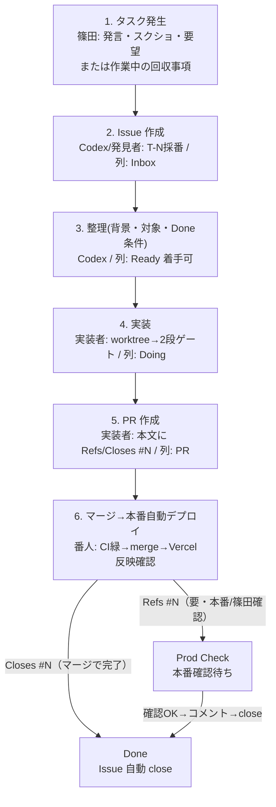

# MatchFav タスク管理 Issue / Project 運用仕様

## 目的

現在の `notes/task-ledger.md` 中心のタスク管理は、AI が読む正本としては機能している一方で、人間が日常的に確認するには長大化している。

また、単一の巨大 Markdown を複数エージェントが編集する構造は、内容クロバー事故を起こしやすい。実際に過去には台帳更新の競合でタスク内容が消える事故が発生している。

本仕様では、タスク管理の正本を GitHub Issue へ移し、GitHub Project を人間向けの一覧にする。AI は GitHub Issue API / Issue 本文 / PR を一次情報として読む。これにより、以下を実現する。

- 人間が GitHub Issue / Project で直感的に確認できる
- AI がタスク番号、状態、次アクション、関連 PR を機械的に追える
- `notes/task-ledger.md` の巨大化と手作業更新ミスを減らす
- Issue / PR / CI / Production 確認 / 完了履歴を GitHub 上で自然に紐付ける
- 単一巨大ファイルの並行編集による内容クロバー事故を構造的に避ける

この仕様は、篠田が明示的に「タスク追加」と言った場合だけでなく、番人・子分・弟子・SUB が作業中に見つけた回収事項にも適用する。

## 基本方針

今後のタスク管理は次の役割分担にする。

| 役割 | 置き場 | 主な利用者 |
|---|---|---|
| タスクの正本 | GitHub Issue | 人間 / AI |
| 人間向け一覧 | GitHub Project | 人間 |
| AI 向け入口 | GitHub Issue API / Issue 本文 | AI |
| 生成索引（任意） | `notes/task-index.md` | AI / レビュー補助 |
| 過去ログ・方針アーカイブ | `notes/task-ledger.md` | AI / 必要時の人間 |
| 補助メモ（移行期間のみ） | `notes/agent-sync.md` | AI / 必要時の人間 |
| 実装差分 | Pull Request | 人間 / AI |
| 本番反映履歴 | Issue コメント / PR | 人間 / AI |

原則:

> Issue = タスク正本
> Project = 人間の一覧
> GitHub Issue API = AI の入口
> task-index.md = 自動生成された補助索引（手書き禁止）
> task-ledger.md = 過去ログ / 方針アーカイブ
> agent-sync.md = 移行期間の補助メモ（正本ではない）

重要:

- 手書きの `task-index.md` は作らない。
- `task-index.md` が必要な場合は GitHub Issue から自動生成する。
- 状態は GitHub Project のカラムを正とする。
- `status:*` ラベルと Project カラムの二重管理は禁止する。
- `notes/agent-sync.md` は段階的に引退し、Issue / PR コメントへ寄せる。
- 発見駆動の回収事項も、Issue / Project に寄せる。

## 発見駆動の回収事項

タスク管理は「先に Issue がある作業」だけを対象にしない。実装、調査、レビュー、本番確認、データ運用の途中で見つかった追加作業もプロジェクト管理対象とする。

分類:

| 発見したもの | 置き場 | Project Status |
|---|---|---|
| 既存タスク内の小さな追加・補足 | 既存 Issue / PR コメント | 既存 Status のまま |
| 別作業として追跡すべき不具合・追加実装・調査 | 新規 Issue | Inbox または Ready |
| 篠田判断、外部情報、データ待ち | 新規または既存 Issue | Waiting |
| main マージ済みで本番/篠田確認待ち | 既存 Issue | Prod Check |
| 作業ではない恒久ルール・方針 | `notes/` | タスク化しない |
| 対応済みだが履歴に残すべきイレギュラー | closed Issue または Issue コメント | Done |

運用ルール:

- 発見者は、回収事項を自分の記憶やローカルメモだけに置かない。
- 既存 Issue に吸収できるならコメントで残す。
- 別作業なら Codex に起票依頼するか、発見者が Issue を起票する。
- 緊急で先に直した場合も、完了済み履歴として Issue コメントまたは closed Issue に残す。
- `notes/agent-sync.md` に一時メモを書いた場合も、追跡が必要なら Issue / PR コメントへ転記する。

### 子分・番人向けの実務ルール

人間を伝言役に戻さないため、作業者は以下を守る。

方針は **確実性を最優先しつつ、手間を増やしすぎない**。すべてを Issue 化するのではなく、追跡が必要なものだけ Issue / Project に載せる。

| 状況 | やること | やらないこと |
|---|---|---|
| 既存 Issue の作業が完了した | Issue / PR コメントに `PR #N`、squash、本番確認を残す | ユーザーに「Codexへ伝えて」とだけ渡す |
| PR中に小さい追加修正を見つけた | PR本文/PRコメントに追記して、そのPR内で処理 | 別Issueを乱立する |
| 別作業として追跡が必要な問題を見つけた | 新規 Issue 化してProjectへ載せる、またはCodexに起票依頼 | ローカルメモや `agent-sync.md` だけに置く |
| 完了済みだがProject履歴に残したい | closed Issue を作る | ユーザー経由の申し送りだけで終わらせる |
| 本番/篠田確認待ちが残る | Projectを `Prod Check` に置き、確認後close | Done扱いにして曖昧にする |

子分・弟子・SUB・番人は、Codexに報告が必要な場合でも、まず GitHub 上の Issue / PR に事実を残す。Codex はその GitHub 上の事実を見て triage する。

Issue化の判断基準:

- **Issue化する**: 状態管理が必要、担当を渡す、後で確認が必要、ユーザー判断待ち、本番確認待ち、再発防止が必要。
- **PRコメントで済ませる**: そのPR内で完結する軽微修正、実装中に見つけて同時に直した小さい不具合、後追い不要な説明。
- **closed Issueにする**: 専用Issueなしで完了したが、Project/incident履歴として残したいもの。

## フロー図

タスクが「誰の手で・どの置き場を通って・どの順で」進むかを図にする。



### 置き場（正本の住み分け）

| 何 | どこ | 誰が見る |
|---|---|---|
| タスクの**正本** | GitHub **Issue** | 人間 / AI |
| **人間の一覧** | GitHub **Project**（板） | 人間 |
| **AI の入口** | `gh issue list` / Issue 本文 | AI |
| 実装の差分 | **Pull Request** | 人間 / AI |
| 過去ログ（凍結） | `task-ledger.md` | 必要時の人間 / AI |

### 役割（横断）

- **篠田**: タスク発生・判断・本番確認
- **Codex**: 採番・Issue 作成 / 整理（triage）
- **実装者（子分 / 弟子 / SUB）**: 実装・PR 作成
- **番人**: マージ・デプロイ確認・Issue close
- **全エージェント**: 作業中に見つけた回収事項を Issue / PR コメントへ残す

## タスク番号

既存の `T-N` 番号は維持する。

- 新規タスクは `T-116` 以降を採番する。
- タイトル形式は `T-116: タスク名` とする。
- 番号は再利用しない。
- 既存の `T-N` は、Issue 移行後も同じ番号で扱う。

例:

```text
T-116: グループカードの余白をスマホで調整する
```

## GitHub Issue 仕様

### Issue タイトル

形式:

```text
T-XXX: 短いタスク名
```

例:

```text
T-116: FAQページの文言を最終調整する
```

### Issue 本文テンプレート

```md
## 背景

なぜ必要か。ユーザーの発言、スクショ、既存挙動など。

## 対象

- 対象ページ:
- 対象コンポーネント:
- 対象外:

## 実装方針

- 既存パターン:
- 変更方針:
- 注意点:

## Done 条件

- [ ] 期待する表示/挙動になっている
- [ ] 対象外画面へ波及していない
- [ ] tsc / lint / 関連テストが通る
- [ ] PR を作成して Issue と紐付ける
- [ ] Production 反映後に確認する

## 関連

- PR:
- 参考:
- スクショ:
```

### 完了コメントテンプレート

Issue を close する前、または close 時に以下をコメントする。

```md
## 完了

- PR: PR #XXX
- squash: `xxxxxxx`
- Production: Ready / success / 確認済み
- 本番確認:
  - `/path` 200
  - 主要表示 OK
- 補足:
  - 残課題があれば別 Issue 化
```

## GitHub Project 仕様

人間が見る主画面は GitHub Project とする。

推奨カラム:

| カラム | 意味 |
|---|---|
| Inbox | まだ整理前 |
| Ready | 着手可能 |
| Waiting | 篠田判断、外部情報、データ待ち |
| Doing | 実装中 |
| PR | PR 作成済み |
| Prod Check | main マージ済み、本番確認待ち |
| Done | 完了 |

Project では長文を読まなくても、タスク状態が分かることを重視する。

状態の正本は Project カラムとする。

- `Ready` / `Waiting` / `Doing` / `PR` / `Prod Check` / `Done` は Project 側で管理する。
- `status:*` ラベルは使わない。
- 状態ラベルと Project カラムの二重管理は禁止する。
- GitHub Project の自動化を可能な範囲で設定し、人間の手動ドラッグを最小化する。

推奨自動化:

- Issue 作成時: `Inbox` へ追加
- PR 作成時: 関連 Issue を `PR` へ移動
- PR merge 時: `Prod Check` へ移動、または `Closes` 付きなら `Done`
- Issue close 時: `Done` へ移動

## ラベル仕様

状態ラベルは使わない。状態は Project カラムで管理する。

種類ラベル:

- `type:bug`
- `type:feature`
- `type:content`
- `type:i18n`
- `type:legal`
- `type:billing`
- `type:data`
- `type:mobile`
- `type:ops`

担当/領域ラベルは必要に応じて追加する。

## PR との紐付け

PR 本文には、関連 Issue を必ず記載する。

完了条件が PR マージで満たされる場合:

```md
Closes #123
```

本番確認後に手動 close したい場合:

```md
Refs #123
```

判断基準:

- マージだけで完了するタスクは `Closes`
- Production 確認や篠田確認が必要なタスクは `Refs` にして、確認後に Issue を close

## AI 向けタスク取得

AI は `notes/task-ledger.md` を現役タスク正本として読まない。現役タスクは GitHub Issue から取得する。

基本コマンド例:

```bash
gh issue list --repo sinoda1114/wc-tournament-tracker --state open --json number,title,labels,assignees,projectItems,updatedAt
```

必要に応じて、特定の Issue を開いて詳細を読む。

```bash
gh issue view <issue-number> --repo sinoda1114/wc-tournament-tracker --comments --json number,title,body,comments,labels,projectItems,state
```

### 自動生成 `notes/task-index.md`

AI やレビュー用に Markdown 一覧が必要な場合だけ、GitHub Issue から自動生成する。

手書き更新は禁止する。

`notes/task-index.md` を作る場合は以下のような短い一覧にする。

```md
# Task Index

| T | Issue | Project | Summary | Next |
|---|---|---|---|---|
| T-105 | #105 | Waiting | 決勝T表にGL突破チームが随時反映されるか確認 | GL突破確定＋ingest後に確認 |
| T-116 | #142 | Ready | FAQ文言調整 | worktree→PR |
```

ルール:

- 詳細本文は書かない。
- Issue 番号・Project カラム・次アクションだけを載せる。
- 正本は Issue / Project とする。
- `task-index.md` は生成物なので、古い場合は破棄して再生成する。
- 手で直さない。

## `notes/task-ledger.md` の扱い

`notes/task-ledger.md` は現役タスク正本から降格する。

今後の扱い:

- 過去の完了履歴
- 重要な方針決定
- タスク番号の歴史
- 移行前の参照用アーカイブ

新規タスクの詳細追記は原則しない。

ただし、移行期間中は既存タスクとの整合のため、必要最低限の追記は許容する。

## `notes/agent-sync.md` の扱い

`notes/agent-sync.md` は現行の申し送りボードとして使われているが、Issue / PR 運用へ移行後は段階的に引退する。

移行後の原則:

- 実装者から番人へのマージ依頼は PR 上で行う。
- タスクの経緯・完了報告は Issue コメントへ残す。
- PR には `Refs #issue` または `Closes #issue` を書く。
- `agent-sync.md` は移行期間中の補助メモに限定し、正本にしない。

引退条件:

- 新規タスクが Issue 正本で起票されている。
- PR マージ依頼が PR / Issue コメントで完結している。
- 番人が Project の `PR` / `Prod Check` カラムを見れば状況判断できる。

引退後:

- `agent-sync.md` はアーカイブ化、または「Issue / PR を見よ」とする短い案内だけにする。

## 既存タスクの移行方針

一括移行は行わず、段階移行する。

### Phase 1: 新規タスクから Issue 化

- 次の新規タスク `T-116` から GitHub Issue を正本にする。
- 既存の未完了タスクは、Phase 2 で Issue 化済み。
- AI は `gh issue list` / `gh issue view` を優先して読む。
- 必要なら自動生成の `task-index.md` を用意する。

### Phase 2: 現役タスクだけ Issue 化

対象候補:

- `T-105`
- `T-79`
- `T-12`
- `T-8`
- `T-35`
- `T-28`

完了済みタスクは原則移行しない。

### Phase 3: 台帳をアーカイブ化

- 実施済み（2026-06-18 反映）。
- `task-ledger.md` の先頭に「現役正本ではない」と明記済み。
- 現役一覧は GitHub Project と GitHub Issue に移行済み。
- 完了履歴は Issue close / PR merge / コメントを正本にする。

## 運用フロー

### 新規タスク作成

1. 次の `T-N` を採番する。
2. GitHub Issue を作成する。
3. GitHub Project の `Inbox` または `Ready` に入れる。
4. 必要なら自動生成スクリプトで `notes/task-index.md` を再生成する。

### 作業中に回収事項を発見した場合

1. 既存 Issue の範囲か、別作業かを判断する。
2. 既存範囲なら Issue / PR コメントに追記する。
3. 別作業なら新規 Issue を作成する、または Codex に起票依頼する。
4. 判断待ちなら `Waiting`、本番確認待ちなら `Prod Check` に置く。
5. メモだけで終わらせず、追跡が必要なものは Project に見える状態にする。

### 実装開始

1. Issue を `Doing` に移す。
2. worktree / feature branch を作る。
3. 実装する。
4. `/ai-review` → commit → `/security-review` を通す。

### PR 作成

1. PR 本文に `Refs #issue` または `Closes #issue` を書く。
2. Project 自動化、または手動で `PR` に移す。
3. CI / Preview を確認する。

### main マージ後

1. Production deploy を確認する。
2. 必要なら Project を `Prod Check` に移す。
3. 本番確認結果を Issue にコメントする。
4. 完了なら Issue を close し、Project を `Done` に移す。
5. 必要なら自動生成スクリプトで `task-index.md` を再生成する。

## 例外

以下は Issue ではなく `notes/` に残してよい。

- 恒久的な開発ルール
- セキュリティ運用
- デプロイ運用
- 価格・課金モデルの長期方針
- データ完全性ポリシー
- 複数タスクにまたがる設計メモ

## レビュー観点

レビューしてほしい点:

- 人間が GitHub Project だけ見れば十分か
- AI が GitHub Issue API と Issue 本文だけで迷わないか
- `task-ledger.md` をどのタイミングで凍結するか
- Issue close を完了正本にして問題ないか
- Production 確認待ちタスクをどう表現するか
- Project カラムが多すぎないか
- `agent-sync.md` をどのタイミングで引退できるか

## 未決事項

- `task-index.md` を作る場合の自動生成スクリプトをどこに置くか
- 完了済みタスクの履歴をどこまで GitHub Issue 化するか
- `notes/agent-sync.md` を完全アーカイブ化するタイミング
